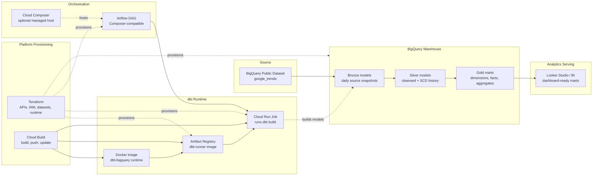

# Global Trend Intelligence Platform

A production-style analytics engineering project on Google Cloud that transforms native BigQuery Google Trends data into historized silver models, dashboard-ready gold marts, and tested reporting outputs.

The project demonstrates how a modern data platform can be built with:

- BigQuery for analytical storage and processing
- dbt for transformation, data quality, documentation, and lineage
- Docker for reproducible dbt execution
- Cloud Run Jobs for serverless dbt execution
- Cloud Build and Artifact Registry for container deployment
- Terraform for infrastructure-as-code
- Airflow-compatible orchestration for production scheduling

## Problem statement

Search trend data is valuable, but raw public datasets are not immediately ready for operational analytics. They need consistent cleansing, historization, quality checks, and curated marts before they can support dashboarding or decision-making.

This project turns BigQuery public Google Trends tables into a structured analytics layer that can answer questions such as:

- Which terms are currently trending across selected countries and markets?
- Which terms are gaining momentum fastest?
- Which regions or US media markets show the most trend activity?
- How did a term's rank change across source refresh snapshots?
- Can the pipeline run reproducibly in local and cloud environments?

## Architecture

The high-level architecture is documented in:

```text
architecture/diagrams/diagram.md
```



## Data model

### Bronze

Bronze models read one source snapshot from BigQuery public Google Trends tables.

Sources:

- `bigquery-public-data.google_trends.international_top_terms`
- `bigquery-public-data.google_trends.international_top_rising_terms`
- `bigquery-public-data.google_trends.top_terms`
- `bigquery-public-data.google_trends.top_rising_terms`

Bronze responsibilities:

- select required columns only
- cast source fields into stable types
- load a single `refresh_date` snapshot
- support optional development filters for cost control

### Silver

Silver models clean and historize the bronze data.

Models:

- `silver_international_top_terms`
- `silver_international_top_rising_terms`
- `silver_us_top_terms`
- `silver_us_top_rising_terms`

Silver responsibilities:

- trim and normalize strings
- standardize date and numeric fields
- deduplicate records at the natural grain
- create SCD-style natural and history keys
- track current and historical versions with validity dates
- enforce SCD integrity through dbt tests

### Gold

Gold models provide dashboard-ready dimensional and fact tables.

Models:

- `dim_geo_market`
- `dim_search_term`
- `fact_trend_rank_history`
- `fact_rising_term_momentum`
- `agg_market_trend_summary`
- `agg_search_term_performance`

Gold responsibilities:

- combine international and US market data
- expose conformed dimensions
- provide rank history and rising-term momentum facts
- produce aggregate tables for BI dashboards

## Quality checks

The dbt project includes tests for:

- not-null key fields
- uniqueness of history keys
- accepted values for key categorical fields
- one current SCD record per natural key
- valid SCD2 date ranges
- no overlapping SCD2 validity windows
- seed-backed macro tests for string cleaning, hashing, and deduplication

Run tests through dbt:

```bash
cd cloud_run_dbt
docker compose run --rm dbt dbt build
```

## Local development

Create a local `.env` file at the repository root. The file is ignored by Git.

Example:

```bash
DBT_BIGQUERY_PROJECT=your-gcp-project-id
DBT_BIGQUERY_DATASET=trend_intelligence_dev
DBT_BIGQUERY_LOCATION=US
DBT_THREADS=4
DBT_MAXIMUM_BYTES_BILLED=20000000000

# Optional development filters
DBT_DEV_COUNTRY_CODES=CH,DE,AT
DBT_DEV_US_MARKET_IDS=500
```

Authenticate with Google Cloud:

```bash
gcloud auth application-default login
gcloud auth application-default set-quota-project your-gcp-project-id
```

Validate the dbt container:

```bash
cd cloud_run_dbt
docker compose run --rm dbt dbt debug
docker compose run --rm dbt dbt parse
docker compose run --rm dbt dbt build
```

## Cloud deployment

Deployment is documented in:

```text
docs/deployment.md
```

The deployment workflow is:

1. Provision infrastructure with Terraform.
2. Build and push the dbt image with Cloud Build.
3. Store the image in Artifact Registry.
4. Execute dbt with a Cloud Run Job.
5. Inspect execution logs in Cloud Logging.

## Orchestration

Orchestration is documented in:

```text
docs/orchestration.md
```

The intended orchestration pattern is:

```text
Airflow DAG -> Cloud Run Job -> dbt build -> BigQuery marts
```

The project is designed to be Cloud Composer-compatible, but Composer is intentionally optional to avoid unnecessary ongoing cost during portfolio development.

## Cost controls

This project includes several cost controls:

- single-snapshot bronze loading by `refresh_date`
- optional explicit source refresh dates
- optional country and US market filters for development
- BigQuery maximum bytes billed guardrail
- separate runtime dataset support for filtered Cloud Run tests
- guidance to avoid full builds during model development

## Repository structure

```text
.
|-- architecture/
|   |-- decision-log.md
|   `-- diagrams/
|       `-- diagram.md
|-- cloud_run_dbt/
|   |-- Dockerfile
|   |-- docker-compose.yml
|   |-- entrypoint.sh
|   |-- requirements.txt
|   `-- dbt/
|       |-- dbt_project.yml
|       |-- profiles.yml
|       |-- macros/
|       |-- models/
|       |   |-- bronze/
|       |   |-- silver/
|       |   `-- gold/
|       |-- seeds/
|       `-- tests/
|-- docs/
|   |-- deployment.md
|   `-- orchestration.md
`-- terraform/
    |-- providers.tf
    |-- service_accounts.tf
    |-- variables.tf
    `-- versions.tf
```

## Architecture decisions

Key architecture decisions and tradeoffs are documented in:

```text
architecture/decision-log.md
```

The decisions explain why the project uses BigQuery-native sources, dbt, SCD-historized silver models, Docker, Cloud Run Jobs, Terraform, and Airflow-compatible orchestration.

## Current status

Implemented:

- BigQuery source definitions
- bronze/silver/gold dbt models
- SCD-style silver historization
- seed-backed macro tests
- silver and gold data quality tests
- Dockerized dbt runtime
- Cloud deployment documentation
- orchestration documentation

Next focus areas:

- dashboard design and reporting queries
- Looker Studio screenshots or dashboard documentation
- README-linked demo walkthrough
