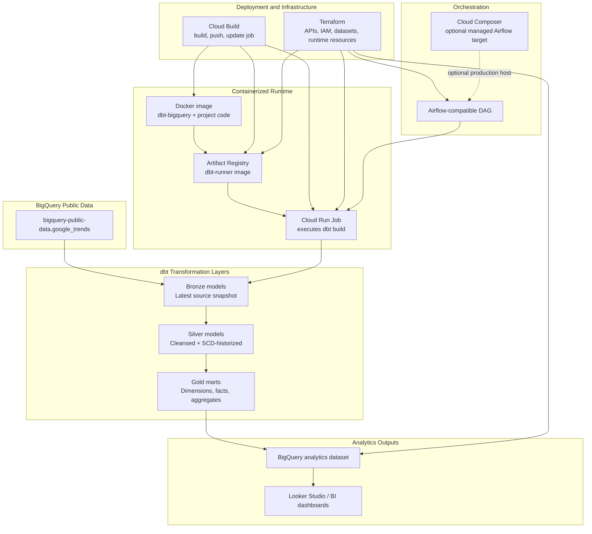

# Architecture Diagram

## Layer responsibilities

| Layer | Responsibility |
| --- | --- |
| BigQuery public data | Native source tables for Google Trends signals. |
| Bronze | Cost-aware daily source snapshots with explicit column selection and optional development filters. |
| Silver | Cleansed, deduplicated, SCD-style historized trend records. |
| Gold | Dashboard-ready dimensions, facts, and aggregate tables. |
| Docker | Reproducible dbt runtime package. |
| Cloud Build | Builds and deploys the dbt container image. |
| Artifact Registry | Stores the deployable dbt image. |
| Cloud Run Job | Executes `dbt build` as a serverless batch workload. |
| Airflow | Coordinates execution and validation without owning transformation logic. |
| Terraform | Provisions repeatable GCP infrastructure and IAM. |