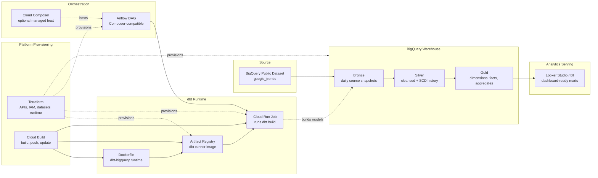

# Architecture Diagram

## Data flow

1. dbt reads Google Trends public tables from BigQuery.
2. Bronze models persist one cost-aware source snapshot.
3. Silver models cleanse, deduplicate, and historize trend records.
4. Gold marts expose dimensional, fact, and aggregate tables for dashboards.

## Control flow

1. Airflow triggers the Cloud Run Job.
2. Cloud Run starts the dbt container.
3. The dbt container runs `dbt build`.
4. Airflow validates expected BigQuery outputs.

## Deployment flow

1. Terraform provisions GCP APIs, IAM, BigQuery, Artifact Registry, and Cloud Run Job resources.
2. Cloud Build builds the dbt Docker image.
3. Cloud Build pushes the image to Artifact Registry.
4. Cloud Build updates the Cloud Run Job to use the latest image.

## Layer responsibilities

| Layer | Responsibility |
| --- | --- |
| BigQuery public data | Native source tables for Google Trends signals. |
| Bronze | Cost-aware daily source snapshots with explicit column selection and optional development filters. |
| Silver | Cleansed, deduplicated, SCD-style historized trend records. |
| Gold | Dashboard-ready dimensions, facts, and aggregate tables. |
| Docker | Reproducible dbt runtime package. |
| Cloud Build | Builds and deploys the dbt container image. |
| Artifact Registry | Stores the deployable dbt image. |
| Cloud Run Job | Executes `dbt build` as a serverless batch workload. |
| Airflow | Coordinates execution and validation without owning transformation logic. |
| Terraform | Provisions repeatable GCP infrastructure and IAM. |