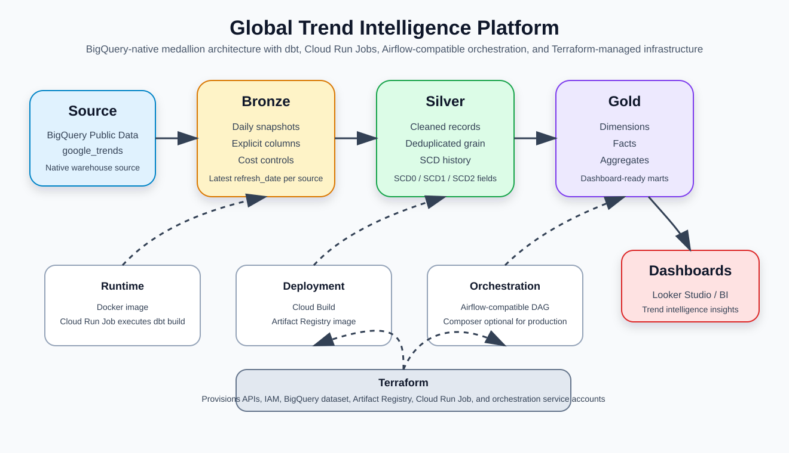

# Medallion Architecture

## Summary

The project follows a BigQuery-native medallion pattern:

- **Bronze** stores cost-aware daily snapshots from BigQuery public Google Trends sources.
- **Silver** applies cleansing, deduplication, and SCD-style historization.
- **Gold** exposes dashboard-ready dimensions, facts, and aggregates.

The transformation runtime is packaged with Docker, deployed through Cloud Build and Artifact Registry, and executed as a Cloud Run Job. Airflow coordinates the Cloud Run Job, while Terraform provisions the cloud infrastructure and IAM boundaries.
